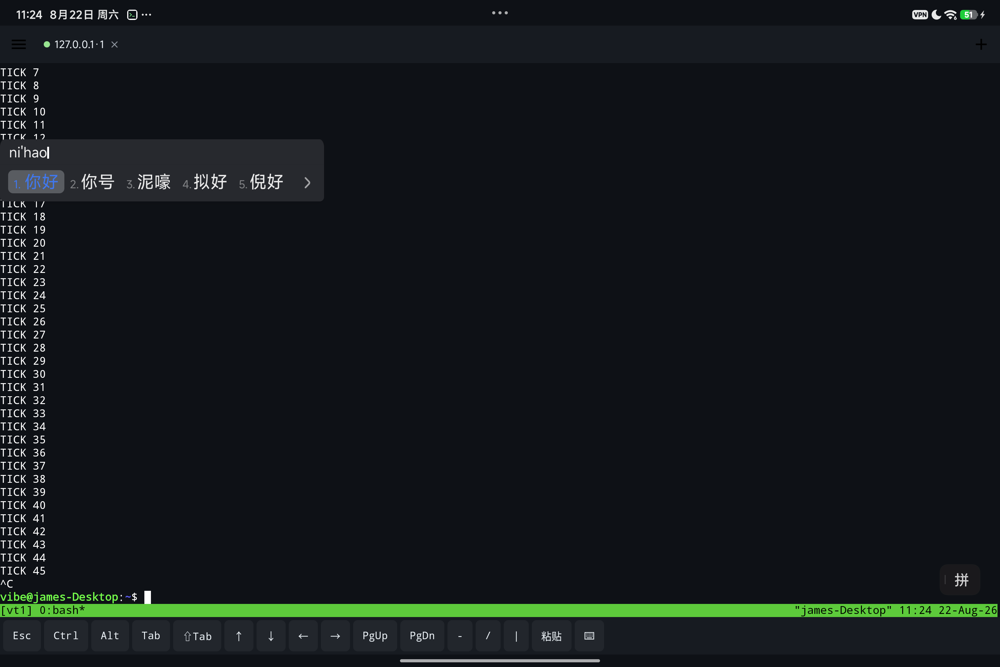

<div align="center">

# ❯ VibeTerm

**为 vibe coding 而生的 Android SSH 终端 —— 在手机/平板上舒服地跑 Claude Code、Codex**

*An Android SSH terminal built for vibe coding — run Claude Code / Codex comfortably from your phone or tablet. Native CJK input, tmux-backed session persistence, lock-screen approval for AI agents.*

GPL-3.0 · minSdk 26 (Android 8.0+) · Kotlin + Jetpack Compose

</div>

---

## 为什么再造一个 SSH 客户端?

市面上的 Android SSH 客户端有三个治不好的病:

1. **打不了中文**。终端类 App 向输入法声明 `TYPE_NULL`,中文输入法直接失效——切到中文输入法界面毫无反应。VibeTerm 重写了 IME 输入链路(真正的 `TYPE_CLASS_TEXT` + 本地预编辑),**百度/搜狗/讯飞/Gboard 开箱即用**(真机实测)。
2. **切窗口费劲**。vibe coding 要同时开好几个窗口盯着 AI 干活。VibeTerm:标签页多会话、平板/横屏双栏分屏、连接活在前台服务里转屏切后台不断。
3. **断线杀进程**。关 App、换网络,跑了半小时的任务就没了。VibeTerm 每个窗口自动 `tmux -u new-session -A -D`,**杀 App、WiFi↔流量切换、重启手机,重连都无缝回到原会话**——服务端兜底,怎么断都不怕。

## 为 AI 编码代理准备的细节

- 🔔 **任务完成通知**:终端响铃 + "忙碌后静默"双信号,AI 跑完任务锁屏也知道
- ✅ **锁屏批准**:检测到 `y/n`、`Do you want…` 等确认提示时,通知直接带**「确认(回车)」「打断(Esc)」按钮**批准 Claude 的工具调用。默认要求先解锁认证(指纹一碰即过),防止拿到设备的人替你放行;可在设置里改为免认证(仅 Android 12+ 能真正强制认证)
- ⌘ **快捷命令面板**:一键发送 `claude -c`、`/compact`、`git status` 等自定义命令
- ⌨️ **附加键条**:Esc(打断)、**Shift+Tab**(Claude Code 切模式)、Ctrl/Alt 闩锁、方向键、bracketed 安全粘贴
- 🚀 **冷启动自动恢复**:App 一开,上次所有窗口自动重连回各自 tmux 会话
- 🌐 **网络秒重连**:监听系统网络切换,变网立即重建连接,不等超时
- 🎨 JetBrains Mono 字体 + GitHub-Dark 终端配色;Ctrl+空格 切输入法(实体键盘惯例)

## 截图

| 中文输入(百度输入法) | 锁屏批准 |
|---|---|
|  |  |

| 终端 | 平板分屏 |
|---|---|
|  |  |

## 服务器要求

- 标准 Linux + sshd,UTF-8 locale(如 `en_US.UTF-8` / `zh_CN.UTF-8`)
- 安装 `tmux`(没有也能用,但失去断线保活)
- 建议:Claude Code 设置 `preferredNotifChannel: terminal_bell`,任务完成即收到手机通知

## 构建

```bash
# 需要 JDK 17;Android SDK(compileSdk 34)
./gradlew :app:assembleDebug
# APK 产物:app/build/outputs/apk/debug/app-debug.apk
```

> `settings.gradle.kts` 中 Maven 仓库将阿里云镜像置于官方仓库之前、Gradle wrapper 使用腾讯镜像,
> 以便中国大陆网络直接构建;镜像内容与官方一致,海外网络亦可正常使用,介意可自行调整顺序。

## 架构

设计文档见 [docs/DESIGN.md](docs/DESIGN.md)(含全部决策记录与里程碑验证过程)。要点:

- `terminal-emulator/`、`terminal-view/`:vendor 自 [termux/termux-app](https://github.com/termux/termux-app),
  打了两组补丁:本地 PTY/JNI 替换为抽象传输层(SSH);IME 输入层重写以原生支持中文。
  修改清单见各模块 README(GPLv3 §5 变更声明)。
- `app/`:Kotlin + Jetpack Compose。SSH 传输用 ConnectBot 维护的
  [sshlib](https://github.com/connectbot/sshlib);断线重连采用 generation 递增使旧 IO 线程自然退出,
  emulator 只创建一次(保留滚回历史);密码经 Android Keystore AES-256-GCM 加密存储;主机指纹 TOFU。

## Roadmap

- [ ] SSH 密钥认证(ed25519)
- [ ] 服务器 tmux 会话浏览(attach 任意已有会话)
- [ ] mosh 传输(与 tmux 叠加优化弱网)
- [ ] 方向键长按连发、回到底部浮钮、键条自定义

## 许可与致谢

本项目以 **GPL-3.0-only** 发布(因内嵌 Termux 终端内核,见 [LICENSE](LICENSE))。
第三方组件清单见 [NOTICE.md](NOTICE.md)。特别感谢
[Termux](https://github.com/termux/termux-app)、
[jackpal/Android-Terminal-Emulator](https://github.com/jackpal/Android-Terminal-Emulator)、
[ConnectBot sshlib](https://github.com/connectbot/sshlib) 与
[JetBrains Mono](https://www.jetbrains.com/lp/mono/)。

Issues 与 PR 欢迎,提交前请跑通 `./gradlew :app:assembleDebug`。
