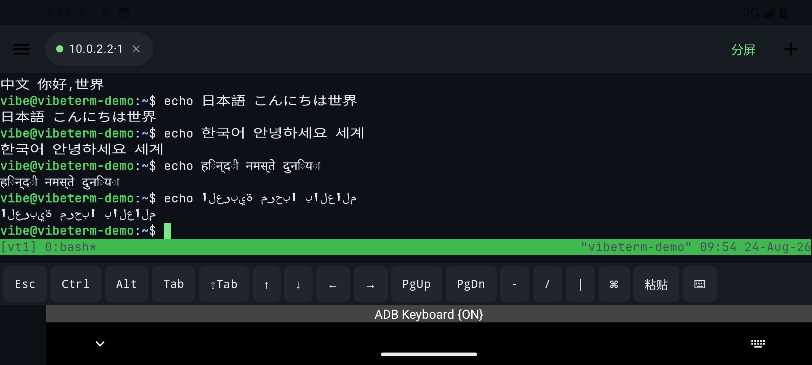
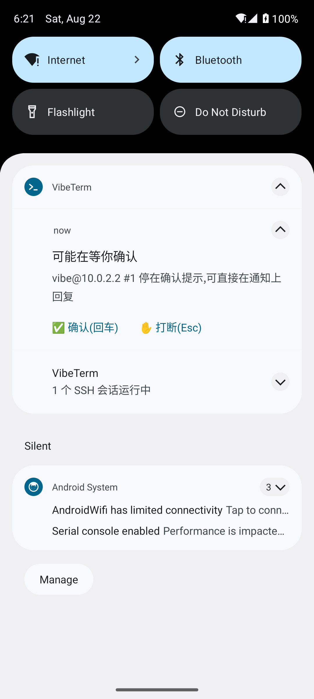
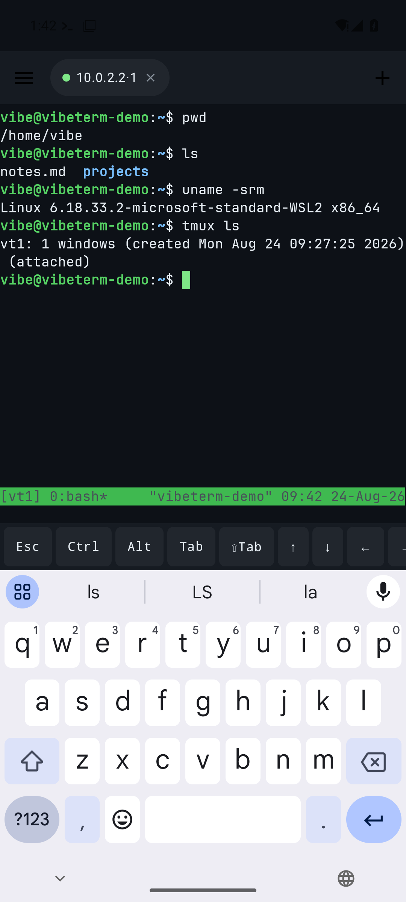
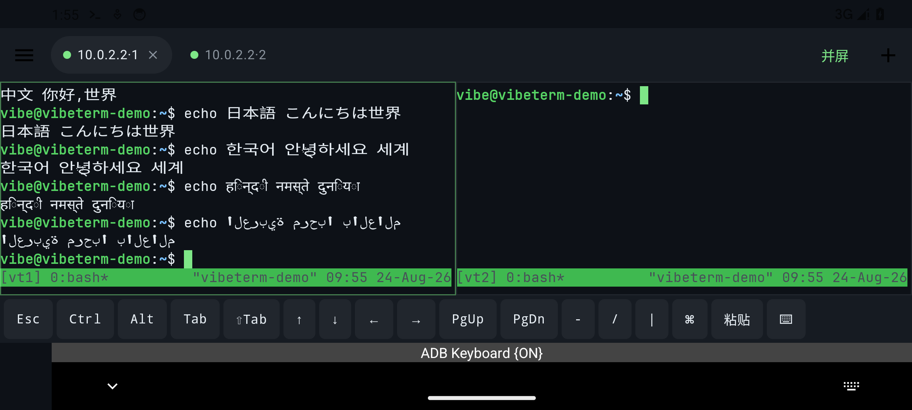

<div align="center">

# ❯ VibeTerm

**为 vibe coding 而生的 Android SSH 终端 —— 在手机/平板上舒服地跑 Claude Code、Codex**

*An Android SSH terminal built for vibe coding — run Claude Code / Codex comfortably from your phone or tablet. Full Android IME / Unicode input (CJK & international keyboards), tmux-backed session persistence, lock-screen approval for AI agents.*

GPL-3.0 · minSdk 26 (Android 8.0+) · Kotlin + Jetpack Compose

[English](README.md) · **中文**

</div>

---

## 为什么再造一个 SSH 客户端?

市面上的 Android SSH 客户端有三个治不好的病:

1. **打不了中文——其实是打不了绝大多数非英文**。终端类 App 常把自己当成"键盘设备":要么向输入法声明 `TYPE_NULL` 只收原始按键、要么只认 KeyEvent 不接受输入法用 `commitText` 提交的 Unicode 文本。结果是**中文、日文、韩文、印地语、阿拉伯语、俄语……凡是依赖输入法组合/提交文本的语言全部受影响**,不止中文。VibeTerm **完整实现了 Android 的 IME/InputConnection 协议**(真正的 `TYPE_CLASS_TEXT` + `setComposingText` 本地预编辑 + `commitText` 按 Unicode 码点转 UTF-8),同时保留硬件控制键(Ctrl/Alt/Esc/Tab)——这是一个比"支持中文"大得多的通用修复。详见 [输入语言支持](#输入语言支持--ime--unicode-input)。百度/搜狗/讯飞/Gboard 已真机实测。
2. **切窗口费劲**。vibe coding 要同时开好几个窗口盯着 AI 干活。VibeTerm:标签页多会话、平板/横屏双栏分屏、连接活在前台服务里转屏切后台不断。
3. **断线杀进程**。关 App、换网络,跑了半小时的任务就没了。VibeTerm 每个窗口自动 `tmux -u new-session -A -D`,**杀 App、WiFi↔流量切换、重启手机,重连都无缝回到原会话**——服务端兜底,怎么断都不怕。

## 为 AI 编码代理准备的细节

- 🔔 **任务完成通知**:终端响铃 + "忙碌后静默"双信号,AI 跑完任务锁屏也知道
- ✅ **锁屏批准**:检测到 `y/n`、`Do you want…` 等确认提示时,通知直接带**「确认(回车)」「打断(Esc)」按钮**批准 Claude 的工具调用。默认要求先解锁认证(指纹一碰即过),防止拿到设备的人替你放行;可在设置里改为免认证(仅 Android 12+ 能真正强制认证)
- ⌘ **快捷命令面板**:一键发送 `claude -c`、`/compact`、`git status` 等自定义命令
- ⌨️ **附加键条**:Esc(打断)、**Shift+Tab**(Claude Code 切模式)、Ctrl/Alt 闩锁、方向键、bracketed 安全粘贴
- 🚀 **冷启动自动恢复**:App 一开,上次所有窗口自动重连回各自 tmux 会话
- 🌐 **网络秒重连**:监听系统网络切换,变网立即重建连接,不等超时
- 🎨 JetBrains Mono 字体 + GitHub-Dark 终端配色;Ctrl+空格 切输入法(实体键盘惯例)

## 输入语言支持 / IME & Unicode input

VibeTerm 解决的不是"中文输入",而是 **Android 终端的 IME/InputConnection 输入本身**。只要你的输入法通过标准的 `setComposingText`/`commitText` 提交文本,VibeTerm 就能把它按 Unicode 码点(含 BMP 之外的 surrogate pair)转成 UTF-8 送进 SSH。因此下列语言都受益(不止中文):

| 档位 | 语言 | 说明 |
|---|---|---|
| 依赖组合+选词,受影响最重 | **中文**(拼音/注音/粤拼)、**日文**(假名→汉字) | 最能体现差异;中文已真机实测,日文机制相同 |
| 依赖组合 | **韩文**(Hangul 组字)、**印地/孟加拉/泰米尔等**印度系文字、transliteration 输入法 | 组合串本地预编辑,选定后上屏 |
| 需要提交非 ASCII Unicode | **俄语/乌克兰语/希腊语**、**阿拉伯语/波斯语/希伯来语**、**泰语/越南语**、带重音的**法/德/西**等 | 不"选词"但需 IME 把 Unicode 交给应用 |
| 基线 | 英语及 ASCII | 一直可用 |

**输入 vs. 显示(如实说明)**:VibeTerm 负责把文本**正确输入**到 SSH 通道。**显示**遵循通用终端的限制——CJK 宽字符、组合附加符号已正确处理;但**从右到左(阿拉伯语/希伯来语)与阿拉伯连写、复杂印度文字连字**在几乎所有终端模拟器里都按单元格从左到右简化渲染,VibeTerm 亦然。也就是说:这些文字**能正确输入、字节能到达服务器**,但终端里的显示可能是简化/LTR 形式。

> 实测:上方「多语言输入」截图为中/日/韩/印地/阿拉伯五种文字经 IME 的 `commitText` 路径输入并由 SSH 回显(与 Gboard/百度等真实输入法提交文本走的是同一个 Android API);中文的候选组合另在真机(百度输入法)验证过全链路。欢迎反馈更多输入法的实测情况。

**界面语言**:App 界面本身提供 **English、简体中文、日本語、한국어**,在 **设置 → 语言** 切换(也支持 Android 13+ 的按应用语言设置)。默认跟随系统语言。

常见问题(为什么安卓 SSH 终端打不了中文/日文/韩文等)见 [docs/FAQ.md](docs/FAQ.md)。完整技术剖析见博客:[Why you can't type Chinese or Japanese in Android SSH terminals — and how to fix it](https://dev.to/metooyang2008/why-you-cant-type-chinese-or-japanese-in-android-ssh-terminals-and-how-to-fix-it-p2a)。

## 截图

| 多语言输入(中/日/韩/印地/阿拉伯) | 锁屏批准 |
|---|---|
|  |  |

| 终端 | 平板分屏 |
|---|---|
|  |  |

## 服务器要求

- 标准 Linux + sshd,UTF-8 locale(如 `en_US.UTF-8` / `zh_CN.UTF-8`)
- 安装 `tmux`(没有也能用,但失去断线保活)
- 建议:Claude Code 设置 `preferredNotifChannel: terminal_bell`,任务完成即收到手机通知

## 安装

- **GitHub Releases**:下载签名 APK 安装([Releases](https://github.com/metoo2008/vibeterm/releases))。当前发布渠道。
- **F-Droid**:计划中(构建配方与商店素材已就绪,见 [docs/FDROID.md](docs/FDROID.md));上架后可在 F-Droid 客户端搜索 “VibeTerm”。

> 说明:本项目内嵌 Termux 的 GPLv3 终端引擎,整体为 **GPL-3.0**。GPLv3 与 Google Play 的分发条款存在已知冲突,
> 且该引擎版权属于 Termux 作者,故**不上架 Google Play**,只走 GPL 友好渠道(F-Droid / GitHub)。
> F-Droid 与 GitHub 的 APK 由不同密钥签名,二者不能相互覆盖升级,请择一渠道安装。

## 构建

```bash
# 需要 JDK 17;Android SDK(compileSdk 36,Android 16)
./gradlew :app:assembleDebug
# APK 产物:app/build/outputs/apk/debug/app-debug.apk
```

> 默认使用官方 Maven 仓库(F-Droid / CI / 海外均可干净构建)。中国大陆开发者可设环境变量
> `VIBETERM_CN_MIRROR=true` 启用阿里云镜像加速;Gradle wrapper 使用腾讯镜像(内容与官方一致,有 SHA-256 校验)。

## 架构

设计文档见 [docs/DESIGN.md](docs/DESIGN.md)(含全部决策记录与里程碑验证过程)。要点:

- `terminal-emulator/`、`terminal-view/`:vendor 自 [termux/termux-app](https://github.com/termux/termux-app),
  打了两组补丁:本地 PTY/JNI 替换为抽象传输层(SSH);IME 输入层重写以原生支持中文。
  修改清单见各模块 README(GPLv3 §5 变更声明)。
- `app/`:Kotlin + Jetpack Compose。SSH 传输用 ConnectBot 维护的
  [sshlib](https://github.com/connectbot/sshlib);断线重连采用 generation 递增使旧 IO 线程自然退出,
  emulator 只创建一次(保留滚回历史);密码经 Android Keystore AES-256-GCM 加密存储;主机指纹 TOFU。

## Roadmap

- [ ] SSH 密钥认证(ed25519)
- [ ] 服务器 tmux 会话浏览(attach 任意已有会话)
- [ ] mosh 传输(与 tmux 叠加优化弱网)
- [ ] 方向键长按连发、回到底部浮钮、键条自定义

## 许可与致谢

本项目以 **GPL-3.0-only** 发布(因内嵌 Termux 终端内核,见 [LICENSE](LICENSE))。
第三方组件清单见 [NOTICE.md](NOTICE.md)。特别感谢
[Termux](https://github.com/termux/termux-app)、
[jackpal/Android-Terminal-Emulator](https://github.com/jackpal/Android-Terminal-Emulator)、
[ConnectBot sshlib](https://github.com/connectbot/sshlib) 与
[JetBrains Mono](https://www.jetbrains.com/lp/mono/)。

Issues 与 PR 欢迎,提交前请跑通 `./gradlew :app:assembleDebug`。
