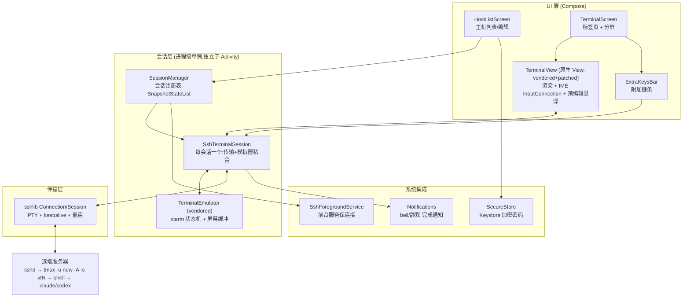

# VibeTerm 设计文档

> 为 vibe coding 优化的 Android SSH 终端。
> 状态:草案 v1(2026-08-22)。本文档是开发准绳,每完成一个里程碑在 §9 勾选。

---

## 1. 背景与问题

作者主要在 Android 手机上通过 SSH 连接开发机,运行 Claude Code、Codex 等 CLI 编码代理。市面上主流 Android SSH 客户端(JuiceSSH、ConnectBot、Termius 等)存在三个无法接受的问题:

1. **中文无法输入**。终端类 App 的输入视图向输入法声明 `TYPE_NULL`("只发原始按键事件"),部分 App 还在 `dispatchKeyEvent` 层拦截软键盘事件。中文输入法依赖组合文本(预编辑/candidates),在这种输入视图上直接失效——切到中文输入法界面毫无反应,只能打英文。Gboard、百度输入法均受影响。
2. **多会话切换体验差**。vibe coding 场景经常同时开 3~5 个窗口(Claude Code ×2、日志、测试、shell),现有客户端切换繁琐。
3. **断线杀进程**。关闭 App、切后台被杀、WiFi↔流量切换,都会断开 TCP → sshd 向会话内进程发 SIGHUP → 长时间运行的测试/代理被杀。

服务器端环境:标准 Linux,UTF-8 locale,支持中文,可以假定能安装 tmux。

## 2. 目标与非目标

### 目标(首版 v0.1)

- **原生中文输入**:任何主流中文输入法开箱可用,预编辑串本地可见,上屏后正确发往远端。
- **多窗口**:标签页式多会话,一键切换;会话生命周期独立于 Activity(转屏/切后台不断)。
- **断线保活**:自动 tmux 接管 + 前台服务 + keepalive + 自动重连,三层防护。
- **附加键条**:Esc / Ctrl / Alt / Tab / Shift+Tab / 方向键 / 粘贴——Claude Code 的刚需键。
- **多服务器管理**:主机列表,密码加密存储(Android Keystore)。
- **任务完成通知**:终端 bell 或"忙碌后静默"时发系统通知。
- **平板/横屏分屏**:宽屏时双栏并排显示两个会话。
- **终端质量**:xterm-256color、真彩色、CJK 双宽字符正确渲染、bracketed paste。

### 非目标(首版不做)

- SSH 密钥认证(二期;首版密码登录)
- mosh 传输(二期,与 tmux 叠加优化弱网流畅度)
- 端口转发 / SFTP / Mosh / ZModem
- 本地 shell(不做 Termux 的事,纯 SSH 客户端)
- 主题市场、自定义键盘布局编辑器
- Google Play 上架合规工作

## 3. 已确认的关键决策

| 决策点 | 结论 | 理由 |
|---|---|---|
| 终端内核 | **Fork Termux** 的 `terminal-emulator` + `terminal-view` 模块 | xterm 兼容性、CJK 宽字符、真彩色均经多年打磨;Claude Code 重 TUI 对兼容性要求高,从零写风险大 |
| 许可证 | **GPLv3**(随 Termux fork 传染) | 自用/开源发布无碍;已知代价,若将来闭源上架需重写内核 |
| 断线保活 | **自动 tmux 接管**(`tmux -u new -A -s <name>`) | 服务端兜底是唯一可靠方案;mosh 解决不了"App 被杀"场景,列为二期 |
| SSH 库 | **org.connectbot:sshlib**(Apache 2.0) | 专为 Android 打造,内置 ed25519/curve25519,免 JCE Provider 折腾;ConnectBot 多年生产验证 |
| UI 框架 | Kotlin + Jetpack Compose;终端本体为传统自定义 View 经 `AndroidView` 嵌入 | 终端渲染/IME 必须原生 View;应用外壳 Compose 开发效率高 |
| 应用名/包名 | VibeTerm / `dev.vibeterm`(可随时改) | 占位名 |
| SDK 版本 | minSdk 26 / compileSdk = targetSdk 34 | 26 覆盖前台服务现代语义;34 匹配 AGP 8.5 |
| 构建 | AGP 8.5.2 + Gradle 8.9 + Kotlin 2.0.21,JDK 17 | 2026 年初稳定组合 |
| 网络环境 | **所有下载走国内镜像**(用户硬性要求) | Gradle→腾讯镜像,Maven→阿里云,工具链→npmmirror/华为云/aka.ms,GitHub 内容→gh-proxy 代理链 |

## 4. 总体架构



模块与目录:

```
ssh-terminal/
├── terminal-emulator/   # vendored (GPLv3): xterm 状态机、屏幕缓冲、KeyHandler、WcWidth
│                        #   补丁:删除 JNI/本地 PTY,TerminalSession 抽象为传输无关基类
├── terminal-view/       # vendored (GPLv3): 终端渲染 View、手势、选区
│                        #   补丁:重写 onCreateInputConnection(中文 IME 核心)+ 预编辑悬浮绘制
└── app/                 # 应用本体 (Kotlin)
    └── dev/vibeterm/
        ├── data/        # HostProfile / HostStore(JSON) / SecureStore(加密)
        ├── ssh/         # SshTerminalSession / SessionManager / Tmux 命令构造
        ├── service/     # SshForegroundService
        ├── notify/      # 通知渠道与完成通知
        └── ui/          # MainActivity / HostListScreen / TerminalScreen / ExtraKeysBar / theme
```

## 5. 关键设计

### 5.1 中文输入链路(核心差异化)

**原则:预编辑留在本地,上屏才发远端。** 远端 shell 没有"未上屏文本"概念,所以拼音组合过程完全在客户端呈现。

`TerminalView.onCreateInputConnection()` 补丁:

- `outAttrs.inputType = TYPE_CLASS_TEXT | TYPE_TEXT_FLAG_NO_SUGGESTIONS`
  (声明为真文本框 → 输入法启用中文模式;NO_SUGGESTIONS 关闭联想。**不能加 VISIBLE_PASSWORD**——真机实测:
  密码类 variation 会让中文输入法强制英文键盘,MIUI 还会进入安全输入模式导致截图全黑,2026-08-22 小米平板+百度输入法验证)
- `outAttrs.imeOptions = IME_ACTION_NONE | IME_FLAG_NO_FULLSCREEN | IME_FLAG_NO_EXTRACT_UI`
- 返回自定义 `BaseInputConnection(view, fullEditor=true)`:

| IME 回调 | 行为 |
|---|---|
| `setComposingText(text)` | 更新本地预编辑串,在光标处绘制悬浮预览(反色/下划线样式),**不发远端** |
| `commitText(text)` | 清除预编辑,文本按 UTF-8 经会话发往远端(经 ctrl/alt 修饰逻辑) |
| `finishComposingText()` | 预编辑非空则视同 commit(与标准编辑器语义一致) |
| `deleteSurroundingText(n, _)` | 转换为 n 个退格(DEL 0x7f)——部分输入法用它实现退格 |
| `sendKeyEvent` | 走 View 既有硬键盘路径(KeyHandler) |
| `performEditorAction` | 发 `\r` |

预编辑悬浮:`TerminalView.onDraw` 末尾,若预编辑非空,在光标单元格位置画圆角底色矩形 + 预编辑文本(用终端同款字体字号),超出右边界时左移。CJK 双宽由 vendored `WcWidth` 保证,渲染器已支持。

硬件键盘、Ctrl/Alt 组合、Esc 等继续走 Termux 原有 `KeyHandler` 路径,与 IME 路径互不干扰。

### 5.2 会话生命周期与断线保活

三层防护:

1. **服务端兜底(根本保障)**:每个窗口的远端命令为
   `tmux -u new-session -A -s vt<N>`(存在则 attach,否则创建;`-u` 强制 UTF-8)。
   服务器未装 tmux 时回落普通 login shell 并在终端提示。断线/杀 App/换网后重连,`-A` 幂等回到原会话,Claude Code 原地继续。
2. **客户端尽力**:有活跃会话时运行 `foregroundServiceType="specialUse"` 前台服务;SSH 层每 15s keepalive;TCP no-delay。
3. **自动重连**:会话状态机 `CONNECTING → CONNECTED → DISCONNECTED → (retry/CLOSED)`。断开后 App 在前台时按 1s/2s/4s…(上限 30s)退避自动重连;后台不重连(省电,反正 tmux 兜底),回前台立即触发。

窗口↔tmux 会话映射:主机 X 的第 N 个标签固定映射 `vt<N>`。App 重启后重开标签即回到原会话,确定性可预期。

### 5.3 SSH 传输层

- `Connection(host, port)` → `connect(verifier, 10s, 20s)` → `authenticateWithPassword`
- `Session.requestPTY("xterm-256color", cols, rows, 0, 0, null)` → `execCommand(tmux 命令)`(带 PTY 的 exec)
- 读线程:`stdout` 流 → `TerminalEmulator.append()`(在会话主 Handler 上);`stderr` 合并处理
- 写:UI 线程调 `session.write()` → 队列 → 写线程 → `stdin`(避免 UI 线程网络 IO)
- resize:`TerminalView` 布局变化 → `updateSize(cols, rows)` → 模拟器 resize + `Session.resizePTY`
- 主机指纹:首次连接 TOFU(信任并存储),之后不匹配则拒连并提示(防中间人,v0.1 简单对话框)

### 5.4 vendored 内核补丁清单

`terminal-emulator`(改动最小化,便于跟上游):

- 删除 `JNI.java` 及 NDK 依赖(本项目无本地 PTY,不需要 NDK)
- `TerminalSession` 拆为抽象基类:进程 fork/waitpid/文件描述符逻辑移除,抽象出
  `transportWrite(bytes)` / `transportResize(cols, rows)` / 子类回调 `onTransportData(bytes)` / `onTransportExited()`
- 其余文件(TerminalEmulator/TerminalBuffer/KeyHandler/WcWidth/TextStyle 等)**零改动**

`terminal-view`:

- `onCreateInputConnection` 重写(§5.1)
- 预编辑悬浮绘制
- 其余(渲染、手势、滚动、选区)零改动

### 5.5 多窗口与 UI

- `SessionManager`:进程级单例,`SnapshotStateList<TermTab>` 驱动 Compose 自动刷新;Activity 重建无损。
- `TerminalScreen`:顶部标签条(会话名 + 状态点:绿=连接/黄=重连中/红=断开)+ "+" 新开窗口;中部 `AndroidView(TerminalView)`;底部 `ExtraKeysBar`;IME 以 `adjustResize` + edge-to-edge insets 处理。
- 附加键条:`Esc | Ctrl | Alt | Tab | S-Tab | ↑ ↓ ← → | - / | | 粘贴 | ⌨`。Ctrl/Alt 为闩锁键(点亮后作用于下一个字符,含 IME 提交的字符);S-Tab 发 `ESC [ Z`(Claude Code 切模式);粘贴走 bracketed paste。
- 分屏:窗口宽度 ≥ 840dp 时标签条出现"分屏"开关,开启后双栏各自独立选择会话,焦点栏高亮,附加键条作用于焦点栏。

### 5.6 任务完成通知

两个信号源,均只在"会话不可见"(非当前标签或 App 在后台)时触发:

1. **终端 bell**(`TerminalSessionClient.onBell`)→ 立即通知。
2. **忙碌后静默启发式**:会话累计输出持续超过 10s 判定"忙碌";忙碌会话静默超过 8s → "任务可能已完成"。可在设置中关闭。

通知点击 → 跳转对应会话标签。服务器端配合(可选,写入 README):Claude Code 设置 `preferredNotifChannel: terminal_bell` 可获得精确通知。

## 6. 数据与安全

- 主机列表:`filesDir/hosts.json`(明文,不含密码)。
- 密码:AndroidKeyStore AES256-GCM 自研加密(不用已废弃的 security-crypto,其传递依赖 tink-android 与 sshlib 内嵌 tink 冲突),密文存私有 SharedPreferences,键 `pw_<hostId>`。
- 主机指纹:`filesDir/known_hosts.json`,TOFU。
- 无任何遥测/网络上报;App 只连用户配置的服务器。

## 7. 构建与工程

- 工具链(全部便携安装于 `D:\dev-tools`,国内源):JDK 17(aka.ms)、Android SDK cmdline-tools + platform 34 + build-tools 34(dl.google.com 直连可用)、MinGit(npmmirror)。
- Gradle wrapper → 腾讯镜像;Maven 仓库 → 阿里云镜像优先,官方兜底(见 `settings.gradle.kts`)。
- 构建验证:`gradlew :app:assembleDebug`;真机验证经 `adb install`。

## 8. 风险与备选

| 风险 | 缓解 |
|---|---|
| sshlib 对新版 OpenSSH 算法协商失败 | 备选:mwiede/jsch(Maven Central 有,阿里云可取);传输层已隔离在 SshTerminalSession 内,可替换 |
| 某些输入法对 VISIBLE_PASSWORD 禁用中文 | 设置项提供 inputType 变体开关(去掉 VISIBLE_PASSWORD 试探);实测为准 |
| specialUse 前台服务在部分厂商 ROM 仍被杀 | tmux 兜底本来就是第一性保障;README 指引用户加电池白名单 |
| Termux 上游更新 | vendor 时记录 commit;补丁最小化,便于手动同步 |

## 9. 里程碑

- [x] **M0 环境与骨架**:国内源工具链、Gradle 工程、模块划分、本设计文档
- [x] **M1 内核落地**:vendor + 补丁(去 JNI、抽象传输),工程编译通过(2026-08-22,首个 app-debug.apk)
- [x] **M2 SSH 打通**:单会话密码登录、显示、英文输入、resize(2026-08-22 模拟器×WSL sshd 验证;Claude Code TUI 待真机)
- [x] **M3 中文输入**:真机(小米平板+百度输入法)拼音组合、候选词、"你好"上屏、UTF-8 到达远端全链路验证通过(2026-08-22)。注:硬件键盘模式下百度用自家浮窗组合(不走 setComposingText),我们的预编辑悬浮框适用于软键盘 inline 组合场景,留待日常使用观察
- [x] **M4 保活**:tmux 自动接管 + 强杀 App 重连无缝回会话已验证(计数器跨强杀存活);弱网自动重连待真机验证
- [~] **M5 多窗口**:标签页多会话已验证(vt1/vt2 独立);附加键条各键功能待逐一验证
- [ ] **M6 多服务器**:主机管理 UI、Keystore 密码存储、TOFU 指纹
- [ ] **M7 完成通知**:bell + 静默启发式
- [ ] **M8 分屏**:≥840dp 双栏
- [ ] **M9 打磨**:配色、字体(考虑内置 CJK 等宽字体)、设置页、README

每个里程碑的验收标准:真机(或至少模拟器)可演示对应能力,且此前所有里程碑不回归。

## 10. 许可证

本项目因 vendor Termux 内核而整体采用 **GPLv3**。`terminal-emulator/`、`terminal-view/` 保留 Termux 版权头;vendor 基线:termux-app master(2026-08-22 快照)。sshlib 为 Apache 2.0,兼容。
